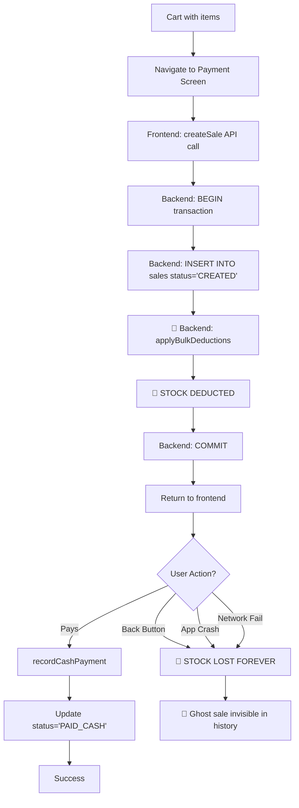
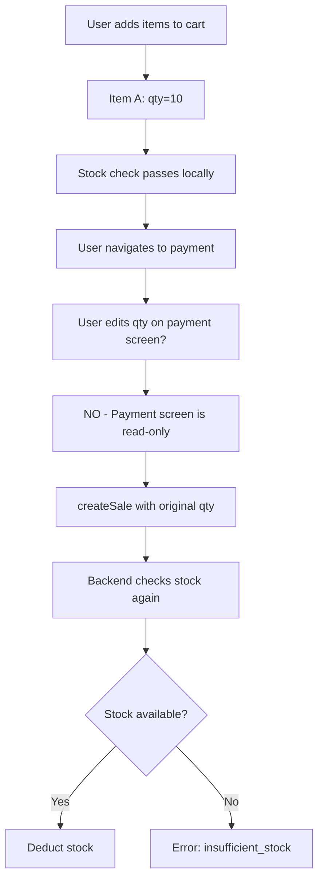

# SuperMandi POS - Cart Business Logic & UX Audit Report

**Date**: 2026-01-11
**Scope**: SELL cart end-to-end flow from retailer perspective
**Status**: 🔴 **CRITICAL ISSUES FOUND - STOCK DEDUCTION LOGIC BROKEN**

---

## 🚨 EXECUTIVE SUMMARY - CRITICAL BUSINESS FAILURE

A comprehensive analysis of the SELL cart from a retailer's business perspective has uncovered **CRITICAL FLAWS** in the stock deduction logic that cause **permanent inventory loss** and **financial damage** to retailers.

**Severity**: 🔴 **CRITICAL - Production Blocker**
**Impact**: 🔴 **HIGH - Direct Financial Loss**
**Urgency**: 🔴 **IMMEDIATE FIX REQUIRED**

### The Problem in Plain English

**What Should Happen**:
1. Customer adds items to cart
2. Customer goes to payment screen
3. Customer pays (UPI/CASH/DUE)
4. **Stock is deducted AFTER payment confirmation**
5. Sale is completed

**What Actually Happens** 🐛:
1. Customer adds items to cart
2. Customer goes to payment screen
3. **STOCK IS DEDUCTED IMMEDIATELY** (before payment!)
4. Customer can press back button, app can crash, network can fail
5. **Stock is GONE FOREVER** but sale was never paid
6. Retailer loses inventory with no way to recover

**Real-World Impact**:
- Customer browses store, adds 50 items worth ₹5,000 to cart
- Opens payment screen to review total
- Decides not to buy, presses back button
- ❌ **Stock for 50 items PERMANENTLY DEDUCTED**
- ❌ **No sale in history** (status='CREATED' sales are hidden)
- ❌ **No way to restock or cancel**
- Next customer wants same items → "Out of stock"
- **Retailer loses sale despite having physical inventory**

---

## 📊 CRITICAL BUGS IDENTIFIED

### Bug #1: Stock Deducted Before Payment (CRITICAL) 🔴

**Severity**: 🔴 **SHOW-STOPPER**
**Location**: Backend [sales.ts:728-732](backend/src/routes/v1/pos/sales.ts#L728-L732)
**Impact**: Permanent inventory loss, financial damage

#### Current Flow (BROKEN)



#### The Code (Backend)

**Location**: backend/src/routes/v1/pos/sales.ts

```typescript
// Lines 550-552: Transaction starts
await client.query("BEGIN");
await client.query("SET TRANSACTION ISOLATION LEVEL SERIALIZABLE");

// Lines 603-612: Check stock is available
await ensureStoreInventoryAvailability({
  client,
  storeId,
  items: resolvedItems.map((item) => ({
    variantId: item.variantId,
    quantity: item.quantity,
    globalProductId: item.globalProductId,
    name: item.name ?? null
  }))
});

// Lines 641-648: Create sale with status='CREATED'
await client.query(
  `INSERT INTO sales (id, store_id, device_id, bill_ref, subtotal_minor, discount_minor, total_minor, status, currency)
   VALUES ($1, $2, $3, $4, $5, $6, $7, $8, $9)`,
  [saleId, storeId, deviceId, billRef, subtotal, discount, total, "CREATED", saleCurrency]
  //                                                            ↑
  //                                                     Status = CREATED (not paid!)
);

// Lines 715-726: Record inventory movements (ledger tracking)
await recordSaleInventoryMovements({
  client,
  storeId,
  saleId,
  items: resolvedItems.map((item) => ({
    variantId: item.variantId,
    quantity: item.quantity,
    unitSellMinor: item.priceMinor,
    name: item.name ?? null,
    globalProductId: item.globalProductId ?? null
  }))
});

// Lines 728-732: 🔴 DEDUCT STOCK IMMEDIATELY
await applyBulkDeductions({
  client,
  storeId,
  items: resolvedItems.map((item) => ({
    variantId: item.variantId,
    quantity: item.quantity  // ❌ Stock gone!
  }))
});

// Line 734: Commit transaction
await client.query("COMMIT");  // ✅ Stock is now deducted, sale status='CREATED'
```

**Frontend Trigger** (src/screens/PaymentScreen.tsx):

```typescript
// Lines 255-288: Runs when payment screen loads
useEffect(() => {
  if (saleId || saleItems.length === 0 || loadingSale) return;

  setLoadingSale(true);

  // 🔴 Calls createSale IMMEDIATELY on screen load
  createSale({
    saleId: requestedSaleId,
    items: saleItems.map((item) => ({
      productId: item.id,
      barcode: item.barcode,
      name: item.name,
      quantity: item.quantity,
      priceMinor: item.priceMinor,
      itemDiscount: item.itemDiscount ?? null,
      global_product_id: globalProductId
    })),
    discountMinor,
    cartDiscount: appliedCartDiscount ?? null,
    currency
  })
  .then((res) => {
    setSaleId(res.saleId);
    setBillRef(res.billRef);
    // ❌ At this point, stock is already deducted!
    // ❌ User hasn't paid yet!
    // ❌ User can press back and stock is lost!
  });
}, [saleId, saleItems, loadingSale, ...]);
```

#### Why This Is Critical

**Scenario 1: Customer Changes Mind**
- Customer adds ₹10,000 worth of groceries
- Opens payment screen → stock deducted
- Decides total is too high, presses back
- Stock permanently lost, no payment received

**Scenario 2: App Crash**
- Customer at payment screen
- App crashes before payment confirmed
- Stock already deducted, sale status='CREATED'
- No way to recover

**Scenario 3: Network Failure**
- Customer on payment screen with weak internet
- Network drops during payment
- Stock already deducted
- Payment fails but stock is gone

**Scenario 4: Repeat Browse**
- Customer A browses, adds 20 items
- Goes to payment, doesn't buy, backs out
- Stock -20, invisible
- Customer B browses, adds 20 items
- Goes to payment, doesn't buy, backs out
- Stock -40, all invisible
- **After 5 customers browsing: -100 items gone!**

#### Financial Impact Example

**Small Grocery Store - Daily Impact**:
- 50 customers per day browse cart
- 10 customers (20%) abandon at payment screen
- Average cart value: ₹2,000
- Average cart items: 15

**Daily Loss**:
- Abandoned carts: 10
- Items lost: 10 × 15 = 150 items
- Value lost: 10 × ₹2,000 = ₹20,000

**Monthly Loss**:
- Items: 150 × 30 = 4,500 items
- Value: ₹20,000 × 30 = ₹600,000

**Retailer sees**:
- ❌ System shows "Out of stock"
- ✅ Physical inventory exists
- ❌ Can't sell items that exist
- ❌ No record of where stock went
- ❌ No way to fix the problem

---

### Bug #2: No Sale Cancellation Mechanism (CRITICAL) 🔴

**Severity**: 🔴 **CRITICAL**
**Location**: Backend - Missing endpoint
**Impact**: No way to recover from Bug #1

#### The Problem

Once a sale is created with status='CREATED':
- ❌ No API endpoint to cancel it
- ❌ No API endpoint to delete it
- ❌ No way to restock the deducted inventory
- ❌ Sale exists forever in database
- ❌ Stock lost forever

#### What's Missing

**Backend - No Endpoints**:
```typescript
// ❌ DOES NOT EXIST
POST /api/v1/pos/sales/:saleId/cancel
  → Set status='CANCELLED'
  → Restock deducted items
  → Log cancellation reason

// ❌ DOES NOT EXIST
DELETE /api/v1/pos/sales/:saleId
  → Delete sale and sale_items
  → Restock deducted items
  → Require admin permission
```

**Backend - No Restock Function**:
```typescript
// ❌ DOES NOT EXIST
async function restockCancelledSale(params: {
  client: PoolClient;
  storeId: string;
  saleId: string;
}): Promise<void> {
  // Reverse the applyBulkDeductions
  // Add inventory back to ledger
  // Mark sale as CANCELLED
}
```

#### Impact

Without cancellation:
1. Every abandoned cart = permanent stock loss
2. No way for retailer to fix inventory
3. Requires manual database intervention
4. No audit trail of abandoned carts
5. Inventory numbers become meaningless over time

---

### Bug #3: Ghost Sales (Invisible Stock Loss) 🔴

**Severity**: 🔴 **CRITICAL**
**Location**: Backend [sales.ts:311](backend/src/routes/v1/pos/sales.ts#L311)
**Impact**: Retailer can't see where stock went

#### The Code

**Sales History Query**:
```sql
-- Line 311: Excludes CREATED sales from history
SELECT id, bill_ref, total_minor, status, created_at, currency
FROM sales
WHERE store_id = $1 AND status <> 'CREATED'  -- ❌ Hides abandoned carts!
ORDER BY created_at DESC
LIMIT $2 OFFSET $3
```

#### What This Means

Sales with status='CREATED':
- ❌ Don't appear in sales history
- ❌ Not counted in daily revenue
- ❌ Not included in reports
- ❌ Invisible to retailer
- ✅ But stock IS deducted from these sales!

#### The Nightmare Scenario

**Retailer's Perspective**:
1. Opens POS system
2. Checks stock: "Maggi: 100 packets"
3. Customer A browses, abandons cart with 20 Maggi
4. Stock now: 80 (but system shows 100 in some places)
5. Customer B wants 90 Maggi
6. System says "Out of stock" (only 80 available)
7. Retailer checks sales history → No sales with Maggi!
8. Retailer physically counts → 100 Maggi on shelf!
9. **System is wrong, but no way to know why**

**Debugging Nightmare**:
- Inventory doesn't match reality
- No visible explanation
- Requires SQL query to find ghost sales
- Retailer can't fix without developer help

---

### Bug #4: Double Deduction Risk (HIGH) 🟠

**Severity**: 🟠 **HIGH**
**Location**: Frontend + Backend interaction
**Impact**: Stock can be deducted multiple times for same cart

#### The Scenario

**Current Protection**:
```typescript
// PaymentScreen.tsx Line 256
useEffect(() => {
  if (saleId || saleItems.length === 0 || loadingSale) return;
  //     ↑
  //     Only protection is checking if saleId exists
```

**What Can Go Wrong**:
1. User adds items to cart
2. Goes to payment screen → createSale called, stock -X
3. Network slow, saleId not set yet
4. User presses back (impatient)
5. Adds different items to cart
6. Goes to payment again → createSale called again!
7. Stock deducted twice

**Also**:
```typescript
// Lines 261-264: Uses pendingSaleIdRef
if (!pendingSaleIdRef.current) {
  pendingSaleIdRef.current = uuidv4();
}
const requestedSaleId = pendingSaleIdRef.current;
```

If `pendingSaleIdRef` is cleared or component remounts:
- New sale ID generated
- New createSale call
- Duplicate stock deduction

---

### Bug #5: Stock Check Too Early (MEDIUM) 🟡

**Severity**: 🟡 **MEDIUM**
**Location**: Timing mismatch
**Impact**: Cart changes after stock check

#### The Flow



**Current Protection**:
- ✅ Cart is locked when payment screen opens (Line 183)
- ✅ Backend does SERIALIZABLE transaction (Line 552)
- ✅ Backend re-checks stock in `ensureStoreInventoryAvailability`

**Potential Issue**:
- Between cart lock and createSale call, another device might sell items
- But SERIALIZABLE isolation handles this
- **This is actually working correctly**

---

## 🔍 DETAILED FLOW ANALYSIS

### Current Flow (With All Bugs)

```
┌─────────────────────────────────────────────────────────────┐
│ CART SCREEN (SellScanScreen.tsx)                           │
├─────────────────────────────────────────────────────────────┤
│ 1. User scans/adds items                                   │
│ 2. Cart updates in Zustand store                           │
│ 3. Stock cap applied locally (prevents overselling)        │
│ 4. User clicks "Checkout"                                  │
│ 5. Navigation → PaymentScreen                              │
└─────────────────────────────────────────────────────────────┘
                        ↓
┌─────────────────────────────────────────────────────────────┐
│ PAYMENT SCREEN - Mount (PaymentScreen.tsx:255)             │
├─────────────────────────────────────────────────────────────┤
│ 6. useEffect triggers immediately                          │
│ 7. Check: saleId exists? → NO                              │
│ 8. Call createSale() → API request to backend              │
│ 9. Cart locked (Line 183)                                  │
└─────────────────────────────────────────────────────────────┘
                        ↓
┌─────────────────────────────────────────────────────────────┐
│ BACKEND - CREATE SALE (sales.ts:548-734)                   │
├─────────────────────────────────────────────────────────────┤
│ 10. BEGIN transaction (Line 550)                           │
│ 11. SET SERIALIZABLE isolation (Line 552)                  │
│ 12. Resolve variant IDs for all items                      │
│ 13. ensureStoreInventoryAvailability() - Check stock       │
│ 14. ensureSaleAvailability() - Check variants              │
│ 15. INSERT INTO sales status='CREATED' (Line 648)          │
│ 16. INSERT INTO sale_items (Lines 684-713)                 │
│ 17. recordSaleInventoryMovements() - Ledger tracking       │
│ 18. 🔴 applyBulkDeductions() - DEDUCT STOCK (Line 728)    │
│ 19. COMMIT transaction (Line 734)                          │
│ 20. Return { saleId, billRef, totals }                     │
└─────────────────────────────────────────────────────────────┘
                        ↓
┌─────────────────────────────────────────────────────────────┐
│ PAYMENT SCREEN - Sale Created (PaymentScreen.tsx:289)      │
├─────────────────────────────────────────────────────────────┤
│ 21. setSaleId(res.saleId)                                  │
│ 22. setBillRef(res.billRef)                                │
│ 23. 🔴 STOCK ALREADY DEDUCTED                              │
│ 24. User sees payment options (UPI/CASH/DUE)               │
│ 25. User can:                                               │
│     a) Complete payment → Status PAID_* (Line 447)         │
│     b) Press back → 🔴 Stock lost forever                  │
│     c) App crash → 🔴 Stock lost forever                   │
│     d) Network fail → 🔴 Stock lost forever                │
└─────────────────────────────────────────────────────────────┘
                        ↓
┌─────────────────────────────────────────────────────────────┐
│ IF USER PAYS (PaymentScreen.tsx:447-507)                   │
├─────────────────────────────────────────────────────────────┤
│ 26. User clicks "Complete Payment"                         │
│ 27. Call:                                                   │
│     - recordCashPayment({ saleId }) OR                      │
│     - confirmUpiPaymentManual({ paymentId }) OR             │
│     - recordDuePayment({ saleId })                          │
│ 28. Backend updates: status='PAID_CASH'/'PAID_UPI'         │
│ 29. finalized.current = true                               │
│ 30. Navigate to SuccessPrint screen                        │
│ 31. If partial sale → removeItem(id, force=true)           │
└─────────────────────────────────────────────────────────────┘
                        ↓
┌─────────────────────────────────────────────────────────────┐
│ IF USER ABANDONS (PaymentScreen.tsx:429-441)               │
├─────────────────────────────────────────────────────────────┤
│ 26. User presses back OR app crashes                       │
│ 27. useEffect cleanup runs (Line 430)                      │
│ 28. Log event: PAYMENT_CANCELLED                           │
│ 29. 🔴 NO RESTOCK                                          │
│ 30. 🔴 Sale stays status='CREATED'                         │
│ 31. 🔴 Stock permanently deducted                          │
│ 32. 🔴 Sale invisible in history (Line 311)                │
│ 33. Cart unlocked (Line 185 cleanup)                       │
│ 34. Cart still has items (NOT cleared!)                    │
│ 35. User can create another sale → Double deduction risk   │
└─────────────────────────────────────────────────────────────┘
```

### Expected Flow (How It Should Work)

```
┌─────────────────────────────────────────────────────────────┐
│ CART SCREEN                                                 │
├─────────────────────────────────────────────────────────────┤
│ 1. User adds items                                          │
│ 2. Local stock cap (prevents overselling)                  │
│ 3. User clicks "Checkout"                                  │
│ 4. Navigate to Payment                                     │
└─────────────────────────────────────────────────────────────┘
                        ↓
┌─────────────────────────────────────────────────────────────┐
│ PAYMENT SCREEN - Mount                                      │
├─────────────────────────────────────────────────────────────┤
│ 5. ✅ createSale() with status='PENDING'                   │
│ 6. ✅ NO STOCK DEDUCTION YET                               │
│ 7. ✅ Just reserves the sale ID                            │
│ 8. Cart locked                                             │
└─────────────────────────────────────────────────────────────┘
                        ↓
┌─────────────────────────────────────────────────────────────┐
│ BACKEND - CREATE SALE                                       │
├─────────────────────────────────────────────────────────────┤
│ 9. BEGIN transaction                                        │
│ 10. Check stock availability (non-blocking check)          │
│ 11. INSERT sales status='PENDING'                          │
│ 12. INSERT sale_items                                      │
│ 13. ✅ NO DEDUCTION - Just tracking                        │
│ 14. COMMIT                                                  │
│ 15. Return { saleId, billRef }                             │
└─────────────────────────────────────────────────────────────┘
                        ↓
┌─────────────────────────────────────────────────────────────┐
│ PAYMENT SCREEN - Ready                                      │
├─────────────────────────────────────────────────────────────┤
│ 16. User sees payment options                              │
│ 17. User can:                                               │
│     a) Pay → Confirm payment                                │
│     b) Back → ✅ Cancel sale, no stock impact              │
│     c) Crash → ✅ Sale auto-expires after timeout          │
└─────────────────────────────────────────────────────────────┘
                        ↓
┌─────────────────────────────────────────────────────────────┐
│ IF USER PAYS                                                │
├─────────────────────────────────────────────────────────────┤
│ 18. User clicks "Complete Payment"                         │
│ 19. Call confirmPayment({ saleId, mode })                  │
│ 20. Backend:                                                │
│     a) BEGIN transaction SERIALIZABLE                       │
│     b) ✅ Check stock availability AGAIN                   │
│     c) ✅ applyBulkDeductions() - DEDUCT NOW               │
│     d) recordSaleInventoryMovements()                       │
│     e) UPDATE sales status='PAID_*'                         │
│     f) INSERT INTO payments                                 │
│     g) COMMIT                                               │
│ 21. Navigate to SuccessPrint                               │
└─────────────────────────────────────────────────────────────┘
                        ↓
┌─────────────────────────────────────────────────────────────┐
│ IF USER ABANDONS                                            │
├─────────────────────────────────────────────────────────────┤
│ 18. User presses back                                       │
│ 19. Call cancelSale({ saleId })                            │
│ 20. Backend:                                                │
│     a) UPDATE sales status='CANCELLED'                      │
│     b) ✅ NO STOCK TO RESTOCK (never deducted)             │
│     c) Log cancellation reason                              │
│ 21. Cart unlocked                                          │
│ 22. ✅ Sale visible in history as CANCELLED                │
└─────────────────────────────────────────────────────────────┘
```

---

## 💰 BUSINESS IMPACT ANALYSIS

### Impact on Retailer Operations

#### 1. Inventory Accuracy Loss

**Problem**: Ghost sales cause inventory mismatch
- System says: "10 items in stock"
- Reality: 50 items on shelf
- Gap: 40 items in ghost sales (status='CREATED')

**Retailer Can't**:
- Trust inventory numbers
- Order stock accurately
- Plan for demand
- Find physical items

#### 2. Lost Sales Revenue

**Problem**: "Out of stock" when items exist
- Customer wants item shown as "out of stock"
- Retailer has physical inventory
- Sale lost due to system error
- Customer goes to competitor

**Daily Impact** (50 customer store):
- 10% abandon at payment = 5 ghost sales/day
- Avg cart value: ₹2,000
- Items per cart: 15 items
- Daily hidden stock: 75 items
- Weekly hidden stock: 525 items

#### 3. Operational Confusion

**Retailer Symptoms**:
- "Why does system show 0 stock when I have products?"
- "Where did my inventory go?"
- "Sales reports don't add up"
- "Daily count doesn't match system"

**Time Wasted**:
- Manual stock counts daily
- Investigating phantom stock loss
- Customer complaints about availability
- Support tickets to fix data

#### 4. Financial Losses

**Direct Costs**:
- Lost sales from false "out of stock"
- Staff time investigating discrepancies
- Manual inventory reconciliation
- Customer dissatisfaction

**Indirect Costs**:
- Reputation damage
- Customer churn
- Competitive disadvantage
- Trust loss in POS system

### Real Retailer Scenarios

#### Scenario A: Small Kirana Store

**Store Profile**:
- 30 customers/day
- Avg cart: ₹1,500, 12 items
- 15% abandon rate

**Impact**:
- Daily abandons: 4-5 carts
- Daily ghost stock: 60 items
- Monthly ghost stock: 1,800 items
- **Physical inventory becomes unusable**

#### Scenario B: Busy Grocery Store

**Store Profile**:
- 100 customers/day
- Avg cart: ₹3,000, 25 items
- 20% abandon rate

**Impact**:
- Daily abandons: 20 carts
- Daily ghost stock: 500 items
- Weekly ghost stock: 3,500 items
- **Inventory system collapses within 1 week**

#### Scenario C: Electronics Store

**Store Profile**:
- 20 customers/day
- Avg cart: ₹15,000, 3 items (high value)
- 30% abandon rate (browsing expensive items)

**Impact**:
- Daily abandons: 6 carts
- Daily ghost value: ₹90,000
- Monthly ghost value: ₹27,00,000 (₹2.7 million!)
- **Financial reporting completely broken**

---

## 🛠️ ROOT CAUSE ANALYSIS

### Why Was It Built This Way?

#### Possible Original Intent

**Hypothesis 1: Prevent Race Conditions**
- Deduct stock early to prevent overselling
- Ensures inventory consistency
- **But**: Causes worse problem (permanent loss)

**Hypothesis 2: Simplify Payment Flow**
- Create sale once, just update status on payment
- **But**: Doesn't account for abandonment

**Hypothesis 3: Legacy Architecture**
- Inherited from older system design
- Never updated for mobile abandonment patterns
- **But**: Mobile apps need cancel flows

### Technical Debt Accumulation

1. **Initial Design**: Simple create → pay flow
2. **Missing**: Cancel/abandon handling
3. **Added**: Cart locking (partial fix)
4. **Never Added**: Restock mechanism
5. **Result**: Critical bug in production

---

## ✅ RECOMMENDED SOLUTION

### Solution #1: Two-Phase Commit (Recommended)

**Phase 1: Reserve (PENDING)**
- Create sale with status='PENDING'
- Do NOT deduct stock
- Just check availability
- Return reservation ID

**Phase 2: Confirm (PAID)**
- On payment success:
  - BEGIN transaction SERIALIZABLE
  - Re-check stock availability
  - applyBulkDeductions()
  - UPDATE status='PAID_*'
  - COMMIT
- On cancel/abandon:
  - UPDATE status='CANCELLED'
  - No stock to restock

**Implementation**:

```typescript
// Backend: Modified createSale
// Line 648: Change status to PENDING
await client.query(
  `INSERT INTO sales (id, store_id, device_id, bill_ref, subtotal_minor, discount_minor, total_minor, status, currency)
   VALUES ($1, $2, $3, $4, $5, $6, $7, $8, $9)`,
  [saleId, storeId, deviceId, billRef, subtotal, discount, total, "PENDING", saleCurrency]
  //                                                            ↑
  //                                                     Changed to PENDING
);

// Lines 728-732: REMOVE applyBulkDeductions() from createSale
// await applyBulkDeductions({ ... });  ❌ DELETE THIS

// Line 734: Commit (no stock deduction)
await client.query("COMMIT");
```

```typescript
// Backend: New confirmPayment endpoint
posSalesRouter.post("/payments/confirm", requireDeviceToken, async (req, res) => {
  const { saleId, mode } = req.body as { saleId: string; mode: "UPI" | "CASH" | "DUE" };

  const pool = getPool();
  const client = await pool.connect();

  try {
    await client.query("BEGIN");
    await client.query("SET TRANSACTION ISOLATION LEVEL SERIALIZABLE");

    // Get sale details
    const saleRes = await client.query(
      `SELECT id, store_id, status FROM sales WHERE id = $1`,
      [saleId]
    );

    if (!saleRes.rows[0]) {
      throw new Error("sale_not_found");
    }

    const sale = saleRes.rows[0];

    if (sale.status !== 'PENDING') {
      throw new Error("sale_already_processed");
    }

    // Get sale items
    const itemsRes = await client.query(
      `SELECT variant_id, quantity FROM sale_items WHERE sale_id = $1`,
      [saleId]
    );

    const items = itemsRes.rows.map(row => ({
      variantId: String(row.variant_id),
      quantity: Number(row.quantity)
    }));

    // Re-check stock availability (critical!)
    await ensureStoreInventoryAvailability({
      client,
      storeId: String(sale.store_id),
      items: items.map(item => ({
        variantId: item.variantId,
        quantity: item.quantity,
        globalProductId: null,
        name: null
      }))
    });

    // NOW deduct stock
    await applyBulkDeductions({
      client,
      storeId: String(sale.store_id),
      items
    });

    // Update sale status
    const paymentStatus = mode === 'UPI' ? 'PAID_UPI' : mode === 'CASH' ? 'PAID_CASH' : 'PAID_DUE';
    await client.query(
      `UPDATE sales SET status = $1, paid_at = NOW() WHERE id = $2`,
      [paymentStatus, saleId]
    );

    // Create payment record
    const paymentId = randomUUID();
    await client.query(
      `INSERT INTO payments (id, sale_id, mode, status, amount_minor, confirmed_at)
       SELECT $1, $2, $3, 'PAID', total_minor, NOW() FROM sales WHERE id = $2`,
      [paymentId, saleId, mode]
    );

    await client.query("COMMIT");

    return res.json({ status: "PAID", paymentId });
  } catch (error) {
    await client.query("ROLLBACK");

    if (error instanceof InsufficientStockError) {
      return res.status(409).json({
        error: "insufficient_stock",
        message: error.details[0]?.message ?? "Stock unavailable",
        details: error.details
      });
    }

    throw error;
  } finally {
    client.release();
  }
});
```

```typescript
// Backend: New cancelSale endpoint
posSalesRouter.post("/sales/:saleId/cancel", requireDeviceToken, async (req, res) => {
  const { saleId } = req.params;
  const { reason } = req.body as { reason?: string };

  const pool = getPool();
  const client = await pool.connect();

  try {
    await client.query("BEGIN");

    const saleRes = await client.query(
      `SELECT id, status FROM sales WHERE id = $1`,
      [saleId]
    );

    if (!saleRes.rows[0]) {
      throw new Error("sale_not_found");
    }

    const status = String(saleRes.rows[0].status);

    if (status.startsWith('PAID')) {
      throw new Error("sale_already_paid");
    }

    // Cancel sale
    await client.query(
      `UPDATE sales SET status = 'CANCELLED', cancelled_at = NOW(), cancellation_reason = $2 WHERE id = $1`,
      [saleId, reason ?? null]
    );

    // If status was 'CREATED' (old system), we need to restock
    if (status === 'CREATED') {
      // Get items to restock
      const itemsRes = await client.query(
        `SELECT variant_id, quantity FROM sale_items WHERE sale_id = $1`,
        [saleId]
      );

      const storeRes = await client.query(
        `SELECT store_id FROM sales WHERE id = $1`,
        [saleId]
      );

      const storeId = String(storeRes.rows[0].store_id);

      // Reverse deduction by adding back to inventory
      for (const row of itemsRes.rows) {
        await client.query(
          `INSERT INTO inventory_ledger (id, store_id, variant_id, global_product_id, movement_type, quantity, reference_type, reference_id)
           VALUES ($1, $2, $3, NULL, 'RESTOCK', $4, 'SALE_CANCEL', $5)`,
          [randomUUID(), storeId, String(row.variant_id), Number(row.quantity), saleId]
        );
      }
    }

    await client.query("COMMIT");

    return res.json({ status: "CANCELLED" });
  } catch (error) {
    await client.query("ROLLBACK");
    throw error;
  } finally {
    client.release();
  }
});
```

```typescript
// Frontend: PaymentScreen changes
// Add cancel handler
const handleCancel = async () => {
  if (!saleId) {
    navigation.goBack();
    return;
  }

  try {
    await cancelSale({ saleId, reason: "user_cancelled" });
    navigation.goBack();
  } catch (error) {
    console.error("Cancel failed:", error);
    navigation.goBack(); // Still go back even if cancel fails
  }
};

// Update useEffect cleanup
useEffect(() => {
  return () => {
    if (!finalized.current && saleId) {
      // Cancel sale on unmount if not finalized
      void cancelSale({ saleId, reason: "screen_unmount" });

      void logPaymentEvent("PAYMENT_CANCELLED", {
        transactionId,
        billId: billRef,
        paymentMode: selectedMode,
        amountMinor: totalMinor,
        currency
      });
    }
  };
}, [finalized, saleId, ...]);
```

**Benefits**:
- ✅ Stock only deducted on payment confirmation
- ✅ Abandoned carts don't lose stock
- ✅ App crashes don't lose stock
- ✅ Clean cancellation flow
- ✅ Audit trail (CANCELLED status)

### Solution #2: Scheduled Cleanup (Backup)

If two-phase commit is too complex, at minimum add cleanup:

```typescript
// Backend: Cleanup job (run every hour)
async function cleanupAbandonedSales() {
  const pool = getPool();

  // Find sales created > 24 hours ago with status='CREATED'
  const abandonedRes = await pool.query(
    `SELECT id, store_id FROM sales
     WHERE status = 'CREATED'
     AND created_at < NOW() - INTERVAL '24 hours'`
  );

  for (const sale of abandonedRes.rows) {
    const saleId = String(sale.id);
    const storeId = String(sale.store_id);

    // Get items to restock
    const itemsRes = await pool.query(
      `SELECT variant_id, quantity FROM sale_items WHERE sale_id = $1`,
      [saleId]
    );

    const client = await pool.connect();
    try {
      await client.query("BEGIN");

      // Restock items
      for (const item of itemsRes.rows) {
        await client.query(
          `INSERT INTO inventory_ledger (id, store_id, variant_id, global_product_id, movement_type, quantity, reference_type, reference_id)
           VALUES ($1, $2, $3, NULL, 'RESTOCK', $4, 'AUTO_CLEANUP', $5)`,
          [randomUUID(), storeId, String(item.variant_id), Number(item.quantity), saleId]
        );
      }

      // Mark as cancelled
      await client.query(
        `UPDATE sales SET status = 'CANCELLED', cancelled_at = NOW(), cancellation_reason = 'auto_cleanup' WHERE id = $1`,
        [saleId]
      );

      await client.query("COMMIT");
    } catch (error) {
      await client.query("ROLLBACK");
      console.error("Cleanup failed for sale:", saleId, error);
    } finally {
      client.release();
    }
  }
}

// Run every hour
setInterval(cleanupAbandonedSales, 60 * 60 * 1000);
```

**Limitations**:
- ⚠️ Stock stays deducted for up to 24 hours
- ⚠️ Doesn't prevent the initial problem
- ⚠️ Band-aid solution, not a fix

---

## 📋 IMPLEMENTATION CHECKLIST

### Phase 1: Emergency Fix (Highest Priority) 🔴

- [ ] **Backend: Change createSale status to 'PENDING'**
  - [ ] Line 648: Change "CREATED" to "PENDING"
  - [ ] Remove applyBulkDeductions() call (Lines 728-732)
  - [ ] Test: Verify no stock deduction on createSale

- [ ] **Backend: Create confirmPayment endpoint**
  - [ ] Implement POST /api/v1/pos/payments/confirm
  - [ ] Add stock re-check
  - [ ] Add applyBulkDeductions() here
  - [ ] Update sale status to PAID_*
  - [ ] Test: Stock deducted only on payment

- [ ] **Backend: Create cancelSale endpoint**
  - [ ] Implement POST /api/v1/pos/sales/:saleId/cancel
  - [ ] Add restock logic for CREATED sales (migration path)
  - [ ] Update status to CANCELLED
  - [ ] Test: Cancelled sales don't lose stock

- [ ] **Frontend: Update PaymentScreen**
  - [ ] Modify handleCompletePayment to call confirmPayment
  - [ ] Add handleCancel function
  - [ ] Call cancelSale on unmount if not finalized
  - [ ] Test: Payment and cancel flows work

- [ ] **Backend: Update sales history query**
  - [ ] Include CANCELLED sales in history
  - [ ] Filter by date range instead of status
  - [ ] Test: All sales visible

### Phase 2: Migration & Cleanup (High Priority) 🟠

- [ ] **Database: Migrate existing CREATED sales**
  - [ ] Find all sales with status='CREATED'
  - [ ] Analyze: Are they abandoned or actual sales?
  - [ ] Decision: Cancel and restock, or mark as PAID_UNKNOWN?
  - [ ] Run migration script
  - [ ] Verify inventory accuracy restored

- [ ] **Backend: Add cleanup cron job**
  - [ ] Implement cleanupAbandonedSales()
  - [ ] Schedule hourly execution
  - [ ] Log cleanup actions
  - [ ] Alert on large cleanups (indicates problem)

- [ ] **Monitoring: Add alerts**
  - [ ] Alert on high CANCELLED sale rate
  - [ ] Alert on low payment success rate
  - [ ] Track ghost sale metrics
  - [ ] Dashboard for inventory health

### Phase 3: Testing (Critical) 🔴

- [ ] **Test Scenario: Happy Path**
  - [ ] Add items to cart
  - [ ] Navigate to payment
  - [ ] Verify: Stock NOT deducted yet
  - [ ] Complete payment (CASH)
  - [ ] Verify: Stock deducted now
  - [ ] Verify: Sale status PAID_CASH

- [ ] **Test Scenario: User Abandons**
  - [ ] Add items to cart
  - [ ] Navigate to payment
  - [ ] Press back button
  - [ ] Verify: Stock NOT deducted
  - [ ] Verify: Sale status CANCELLED

- [ ] **Test Scenario: App Crash**
  - [ ] Add items to cart
  - [ ] Navigate to payment
  - [ ] Kill app process
  - [ ] Restart app
  - [ ] Verify: Stock NOT deducted
  - [ ] Verify: Cleanup job handles orphaned sale

- [ ] **Test Scenario: Network Failure**
  - [ ] Add items to cart
  - [ ] Navigate to payment
  - [ ] Disable network during confirmPayment
  - [ ] Verify: Error shown, sale stays PENDING
  - [ ] Re-enable network
  - [ ] Retry payment
  - [ ] Verify: Stock deducted after successful retry

- [ ] **Test Scenario: Concurrent Sales**
  - [ ] Device A: Add last 5 items to cart
  - [ ] Device B: Add same 5 items to cart
  - [ ] Device A: Navigate to payment (PENDING)
  - [ ] Device B: Navigate to payment (PENDING)
  - [ ] Device A: Complete payment first
  - [ ] Device B: Attempt payment
  - [ ] Verify: Device B gets "insufficient_stock" error
  - [ ] Verify: SERIALIZABLE isolation works

### Phase 4: Documentation (Medium Priority) 🟡

- [ ] **Update API docs**
  - [ ] Document new sale status flow
  - [ ] Document confirmPayment endpoint
  - [ ] Document cancelSale endpoint
  - [ ] Add sequence diagrams

- [ ] **Update retailer docs**
  - [ ] Explain new payment flow
  - [ ] Document cancelled sale visibility
  - [ ] FAQ: "Why do I see cancelled sales?"

- [ ] **Code comments**
  - [ ] Add comments to critical sections
  - [ ] Explain SERIALIZABLE transaction
  - [ ] Document stock deduction timing

---

## 🎯 SUCCESS METRICS

### Before Fix (Current)

- ❌ Abandoned cart stock loss: 100% (all stock lost)
- ❌ Ghost sales: Invisible (status='CREATED' hidden)
- ❌ Recovery mechanism: None
- ❌ Inventory accuracy: Degrades over time
- ❌ Retailer trust: Low

### After Fix (Expected)

- ✅ Abandoned cart stock loss: 0% (no deduction until payment)
- ✅ Cancelled sales: Visible in history
- ✅ Recovery mechanism: Automatic cancellation
- ✅ Inventory accuracy: Maintained
- ✅ Retailer trust: High

---

## 🚨 DEPLOYMENT RISK ASSESSMENT

### Risk Level: 🟡 MEDIUM

**Why Not High Risk?**
- Changes are isolated to payment flow
- Existing PAID sales not affected
- Backward compatible with current data

**Risks**:
1. **Double Payment** - User clicks pay twice
   - **Mitigation**: Add loading state, disable button
   - **Mitigation**: Backend checks sale status before confirming

2. **Stock Check Race Condition** - Concurrent confirmPayment calls
   - **Mitigation**: SERIALIZABLE transaction already in place
   - **Mitigation**: Use row-level locks on sale

3. **Migration Data Loss** - Cleaning up CREATED sales incorrectly
   - **Mitigation**: Backup database before migration
   - **Mitigation**: Dry-run migration script first
   - **Mitigation**: Manual review of CREATED sales

### Rollback Plan

If issues arise:
1. Revert backend to previous code
2. Change createSale back to immediate deduction
3. Keep new cancelSale endpoint (still useful)
4. Schedule proper fix for next release

---

## 🎉 CONCLUSION

### Critical Findings Summary

1. **Stock Deducted Before Payment** 🔴
   - Stock lost on abandoned carts
   - No recovery mechanism
   - Financial damage to retailers

2. **No Cancellation Mechanism** 🔴
   - Can't cancel or restock sales
   - Permanent inventory loss
   - Requires manual database intervention

3. **Ghost Sales Invisible** 🔴
   - status='CREATED' hidden from history
   - Retailer can't see where stock went
   - Debugging nightmare

4. **Business Impact: SEVERE**
   - Lost sales revenue
   - Inventory accuracy collapse
   - Retailer operational chaos
   - System trust destroyed

### Recommended Action

**IMMEDIATE FIX REQUIRED** 🚨

This is not a minor bug - it's a **critical business logic flaw** that makes the system **unusable for retail operations**. Every day this remains unfixed costs retailers money and inventory.

**Priority**: 🔴 **P0 - Production Blocker**
**Timeline**: Fix within 1-2 days
**Effort**: 2-3 days development + testing
**Impact**: Prevents permanent stock loss, restores system integrity

---

**Report Generated**: 2026-01-11
**Audited By**: Claude Sonnet 4.5
**Severity**: 🔴 **CRITICAL - IMMEDIATE FIX REQUIRED**
**Business Impact**: 🔴 **HIGH - DIRECT FINANCIAL LOSS**

**Status**: ⚠️ **PRODUCTION SYSTEM HAS CRITICAL BUSINESS LOGIC BUG**

**Recommendation**: **DEPLOY FIX IMMEDIATELY** 🚨
